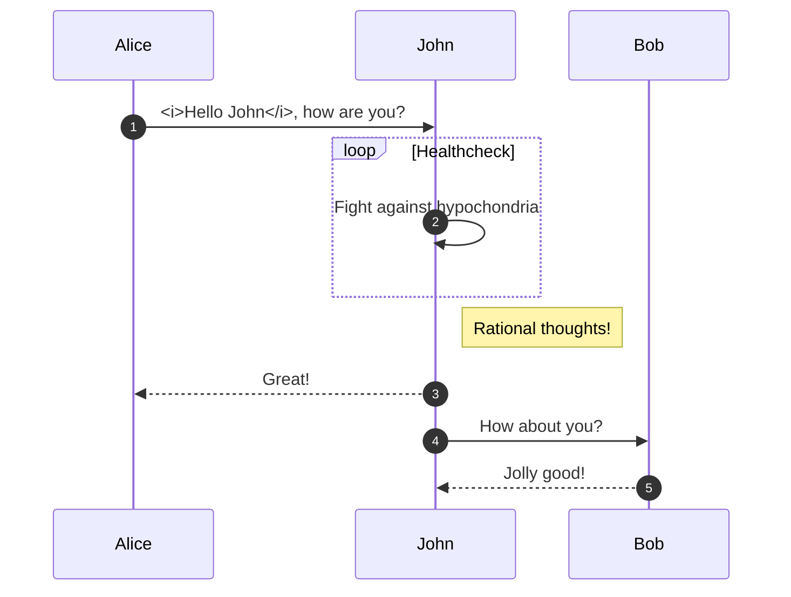

# main.c

## `main` (func)

```mermaid
sequenceDiagram
  autonumber
  Alice->>John: <i>Hello John</i>, how are you?
  loop Healthcheck
      John->>John: Fight against hypochondria
  end
  Note right of John: Rational thoughts!
  John-->>Alice: Great!
  John->>Bob: How about you?
  Bob-->>John: Jolly good!
```
